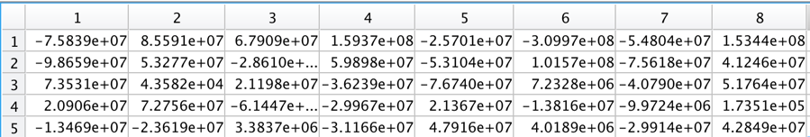
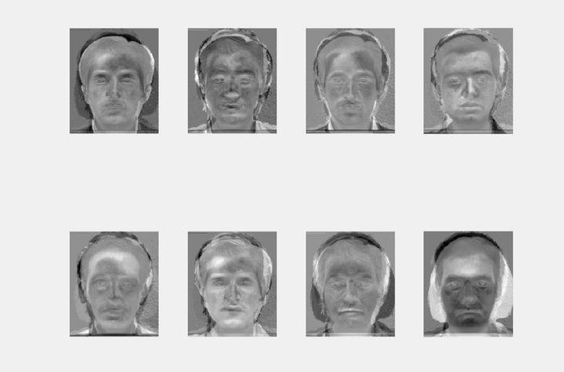
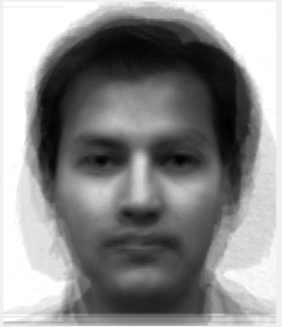

# FaceRecognitionPCA
more result details see report.pdf

## Result:
### The PCA coefficients (𝛺𝑖) for each training image.

### 8 eigenfaces:

### Mean face:


## Try the parameters
**FIRST TRY**  

when we choose Top 5 eigen faces.
T0: 1.4e14 						T1: 2e8
For pic13: we should not recognize it as any face. The distance is 8.09e7.
For apple: the distance0=8.98e11
For pic 6: the distance0=7.79e11

**SECOND TRY**  

when we choose top 6 eigen faces.
For pic13: we should not recognize it as any face. The distance is 8.09e7.

For apple: the distance0=9e11  
For pic 6: the distance0=7.8e11  
Wrong answer number is 2.

**THIRD TRY：**  

When we choose top 7 eigen faces:
For pic13: we should not recognize it as any face. The distance is 8.6e7.

For apple: the distance0=9.13e11  
For pic 6: the distance0=7.8e11  
For pic 1:

**FORTH TRY**  

When we choose all
For pic13: we should not recognize it as any face. The distance is 8.6e7.

For apple: the distance0=9.13e11   
For pic 6: the distance0=7.8e11  

Conclusion: There is little differences between the four choices, we choose TOP 5 eigenvaluse to finish this project.


### Code For Training the pics and get eigen face:
```
clear  % calc xmean,sigma and its eigen decomposition  
close all
train_all=[];%Ri
trainpic=[01,02,03,07,10,11,14,15];
T0=1.4e14;
T1=2e8;
for i=1:length(trainpic)
    if(trainpic(i)<10)
        pic_temp=imread(strcat('Face dataset/subject0',int2str(trainpic(i)),'.normal','.jpg'));
    else
        pic_temp=imread(strcat('Face dataset/subject',int2str(trainpic(i)),'.normal','.jpg'));
    end
    [r c]=size(pic_temp);
    pic_reshape=double(reshape(pic_temp,[r*c,1]));
    train_all=[train_all pic_reshape];%add column
end
train_mean=mean(train_all,2); %meanface m;
figure
imshow(mat2gray(reshape(train_mean,r,c)));

mean_reshape=reshape(train_mean,[r*c,1]);
mean_all=repmat(mean_reshape,[1,length(trainpic)]);
train_A=train_all-mean_all;%compute Matrix A:R=Ri-m
train_L=train_A'*train_A;%cannot compute C:A*A',compute L
top=5;
[evect, eval]=eigs(train_L,top);
[vectorall, valueall]=eig(train_L);


train_V=evect;%put L into single matrix
%train_V=evect;
train_U=train_A*train_V;%eigen faces

%5 eigen face
figure;
for i=1:top
    eiface=train_U(:,i);
    subplot(1,top,i);
    imshow(mat2gray(reshape(eiface,r,c)));
end

%compute 8 projection
omg=[];
for i=1:length(trainpic)
    omg=[omg train_U'*train_A(:,i)];%computer projection face omega
end
```

### Code for recognizing:
```
%recongize
tall_omg=[];
temp_array=[];
dall0=[];
for i=1:18
    if(i<10)
        pic_temp=imread(strcat('test/subject0',int2str(i),'.jpg'));
    else
        pic_temp=imread(strcat('test/subject',int2str(i),'.jpg'));
    end
    pic_reshape=double(reshape(pic_temp,[r*c,1]));
    test_I=pic_reshape-train_mean;%compute I
    figure;
    imshow(mat2gray(reshape(test_I,r,c)));
    %string1=sprintf('%s%d','t',i,'.jpg');
    %imwrite(mat2gray(reshape(test_I,r,c)),string1);
    test_omg=train_U'*test_I;
    tall_omg=[tall_omg test_omg];
    test_IR=train_U*test_omg;
    figure;
    %string2=sprintf('%s%d','tIR',i,'.jpg');
    imshow(mat2gray(reshape(test_IR,r,c)));
    %imwrite(mat2gray(reshape(test_IR,r,c)),string2);
    d0=norm(test_IR-test_I,1);
    dall0=[dall0,d0];
    if(d0<T0)
        h=msgbox('This is not face');
    else
        dis=1e30;
        for j=1:length(trainpic)
            temp=norm(test_omg-omg(:,j),1);
            if(temp<dis)
                dis=temp;
                dect=j;
            end
            temp_array=[temp_array temp]%distance
        end
        if(dis<T1)
            msg=sprintf('%s%d%s','This is ', trainpic(dect),' face');
            h=msgbox(msg);
        else
            h=msgbox('We can not recognize');
        end
    end
end
```
